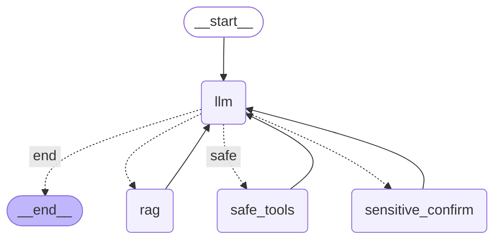

# Sale Chatbot - AI-Powered E-commerce Assistant

## Tổng quan

Sale Chatbot là hệ thống chatbot bán hàng thông minh được xây dựng với kiến trúc RAG (Retrieval-Augmented Generation) và LangGraph, hỗ trợ tư vấn sản phẩm, quản lý đơn hàng và chăm sóc khách hàng tự động.

## Kiến trúc hệ thống

### Core Components

- **LangGraph Workflow**: Quản lý luồng xử lý hội thoại với routing thông minh
- **RAG System**: Tìm kiếm semantic với ChromaDB và vector embeddings
- **Multi-Model AI**: Hỗ trợ Google Gemini, OpenAI, Transformer models
- **Database Layer**: SQLite với schema đầy đủ cho e-commerce
- **Tool System**: Safe tools và Sensitive tools với xác thực

### Workflow Diagram

Luồng xử lý được mô tả trong file `illustration/workflow.mmd`:




## Tính năng chính

### 1. Tư vấn sản phẩm thông minh
- Tìm kiếm sản phẩm theo danh mục, tên, từ khóa
- So sánh sản phẩm với thông tin bổ sung từ web
- Gợi ý sản phẩm khuyến mãi
- Tư vấn cá nhân hóa dựa trên lịch sử

### 2. Quản lý đơn hàng
- Tạo đơn hàng mới với validation
- Xem giỏ hàng và quản lý pending orders
- Hỗ trợ nhiều phương thức thanh toán
- Tự động cập nhật tồn kho

### 3. Quản lý khách hàng
- Đăng ký khách hàng mới
- Cập nhật thông tin cá nhân
- Lưu trữ lịch sử tương tác

### 4. RAG Knowledge Base
- Tìm kiếm thông tin công ty từ knowledge base
- Hỗ trợ câu hỏi về chính sách, dịch vụ
- Tích hợp với ChromaDB cho vector search

## Cài đặt

### Yêu cầu hệ thống
- Python 3.12.11
- SQLite3
- ChromaDB

### Cài đặt dependencies
```bash
pip install -r requirements.txt
```

### Khởi tạo database
```bash
python setup_db.py
```

### Chạy ứng dụng
```bash
python main.py
```

### Tạo ERD diagram
```bash
pip install eralchemy

# pip install graphviz
conda install -c conda-forge graphviz

eralchemy -i sqlite:///database/repo/store.db -o illustration/erd.png
```

## Cấu trúc dự án

```
sale_chatbot/
├── main.py                 # Entry point
├── setup_db.py            # Database initialization
├── src/
│   ├── controller/        # LangGraph workflow controller
│   ├── models/           # AI models (Google, OpenAI, Transformer)
│   ├── chatTools/        # RAG system và tools
│   ├── Prompts/          # System prompts
│   └── utils/            # Utility functions
├── database/
│   ├── repo/             # SQLite database
│   ├── chroma_db/        # ChromaDB vector store
│   └── rag/              # Knowledge base documents
└── illustration/         # ERD và workflow diagrams
```

## Công nghệ sử dụng

- **LangGraph**: Workflow orchestration
- **ChromaDB**: Vector database cho RAG
- **SQLite**: Relational database
- **Google Gemini**: LLM chính
- **OpenAI**: Embedding model
- **Tavily**: Web search API
- **Transformers**: Local embedding model

## Database Schema

Hệ thống sử dụng SQLite với schema đầy đủ cho e-commerce:
- `customers`: Thông tin khách hàng
- `products`: Danh mục sản phẩm
- `categories`: Phân loại sản phẩm
- `orders`: Đơn hàng
- `order_details`: Chi tiết đơn hàng
- `promotions`: Khuyến mãi
- `support_tickets`: Hỗ trợ khách hàng
- `chat_sessions`: Quản lý phiên chat
- `chat_messages`: Lưu trữ tin nhắn với embeddings

## Cấu hình

### Environment Variables
```bash
# Google Gemini API
GOOGLE_API_KEY=your_api_key

# OpenAI API (cho embeddings)
OPENAI_API_KEY=your_api_key

# Tavily Search API
TAVILY_API_KEY=your_api_key
```

### RAG Configuration
- Chunk size: 500 tokens
- Chunk overlap: 50 tokens
- Top-k results: 3
- Embedding model: text-embedding-ada-002

## API Endpoints

### Safe Tools (không cần xác thực)
- `check_categories()`: Lấy danh sách danh mục
- `list_products_by_category()`: Sản phẩm theo danh mục
- `get_product_by_name()`: Tìm sản phẩm theo tên
- `compare_products()`: So sánh sản phẩm
- `get_discounted_products()`: Sản phẩm khuyến mãi
- `smart_search()`: Tìm kiếm web

### Sensitive Tools (cần xác thực)
- `add_order()`: Tạo đơn hàng mới
- `view_cart()`: Xem giỏ hàng
- `register_customer()`: Đăng ký khách hàng
- `get_customer_info()`: Thông tin khách hàng
- `update_customer_info()`: Cập nhật thông tin

## Monitoring & Analytics

Hệ thống tích hợp monitoring cho:
- Số lượng tin nhắn per session
- Tool usage statistics
- Conversation summarization
- Performance metrics

## Mở rộng

### Thêm model mới
1. Tạo class model trong `src/models/`
2. Cập nhật `src/models/__init__.py`
3. Cấu hình trong controller

### Thêm tool mới
1. Định nghĩa tool function với decorator `@tool`
2. Thêm vào `safe_tools` hoặc `sensitive_tools`
3. Cập nhật system prompt

### Tùy chỉnh RAG
1. Thêm documents vào `database/rag/`
2. Cấu hình chunk size và overlap

## Troubleshooting

### Lỗi thường gặp
1. **Database connection failed**: Kiểm tra file `database/repo/store.db`
2. **ChromaDB error**: Xóa folder `database/chroma_db/` và tạo lại
3. **API key invalid**: Kiểm tra environment variables
4. **Memory issues**: Giảm `len_summary` trong controller

---

**Lưu ý**: Đây là phiên bản demo. Để sử dụng production, cần cấu hình bảo mật và monitoring đầy đủ.